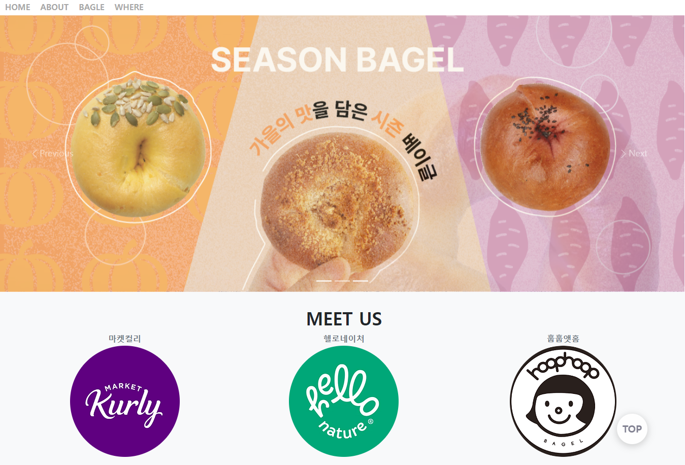
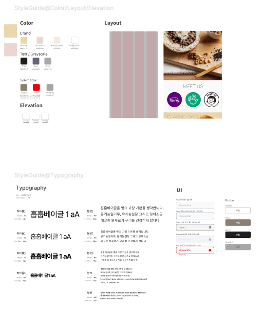
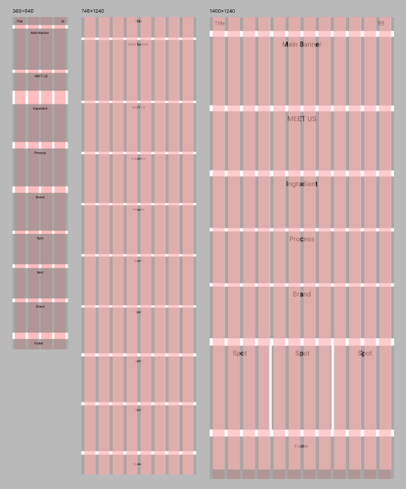

# 프로젝트1 훕훕베이글
<!-- 샵으로 시작하면 타이틀 6개쓰면 h6 -->

> 훕훕베이글 리디자인

부트스트랩과 CSS를 사용하여 훕훕베이글 사이트을 리디자인하고 기존에 없던 반응형을 구현해 보았습니다.

## 기술사양

HTML ver5 / CSS Ver3 / JQUERY / JAVASCRIPT / BOOTSTRAP Ver5 

## 스타일가이드

> 훕훕베이글 웹사이트를 디자인하기 위해 사용할 색상과 폰트 /UI 등을 스타일가이드로 작성해보았습니다.

## 와이어프레임 스케치

>훕훕베이글에 사용할 반응형 와이어프레임 예시를 피그마에서 작성해보았습니다.
